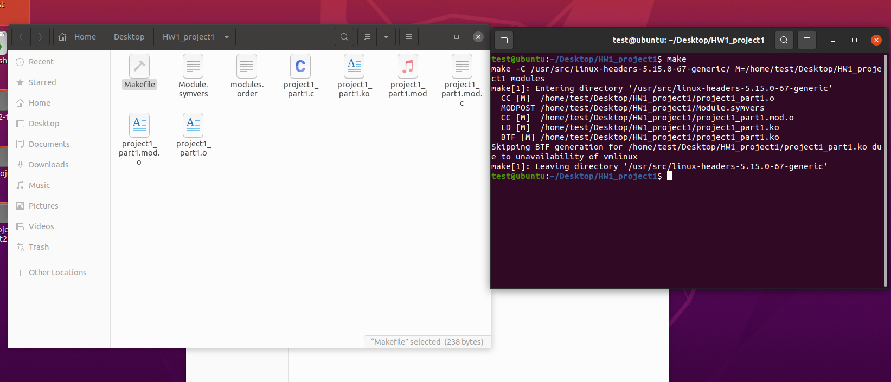
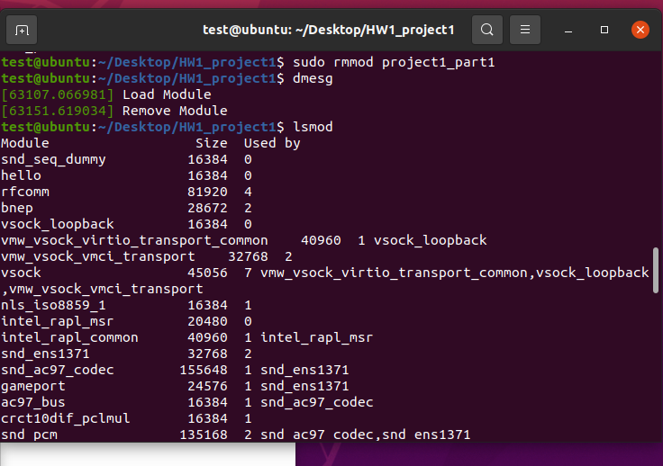
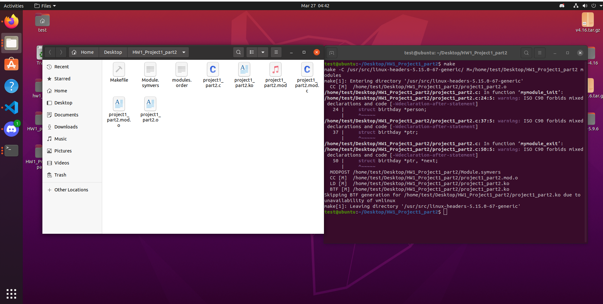
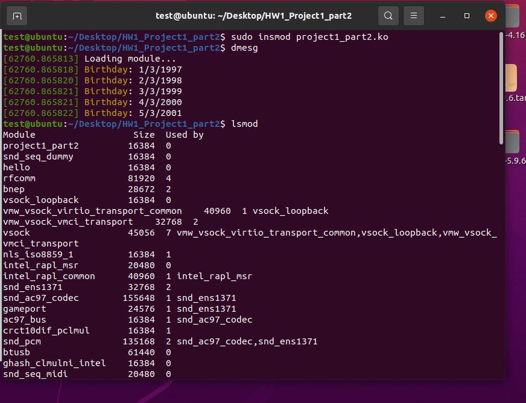
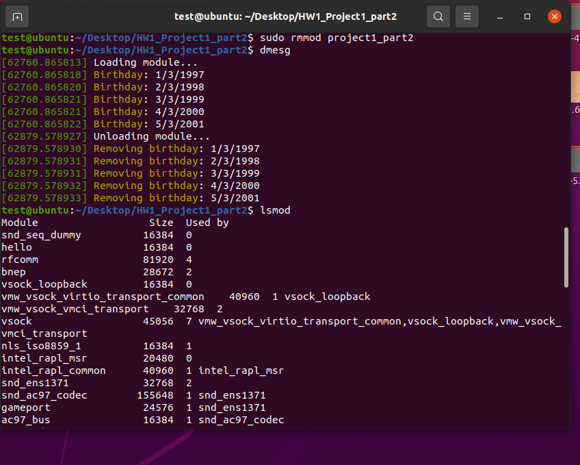

# Document
## Part 1
將程式碼和makefile寫好後make

要先清空核心日誌緩衝區
```
sudo dmesg -c
```
輸入指令載入核心模組
```
sudo insmod project1_part1.ko
```
輸入指令檢視
```
dmesg
```
顯示目前載入核心模組
```
lsmod
```

移除核心模組
```
sudo insmod project1_part1.ko
```
輸入指令檢視
```
dmesg
```


## Part 2
將程式碼和makefile寫好後make

要先清空核心日誌緩衝區
```
sudo dmesg -c
```
輸入指令載入核心模組
```
sudo insmod project1_part2.ko
```
輸入指令檢視
```
dmesg
```
顯示目前載入核心模組
```
lsmod
```

移除核心模組
```
sudo insmod project1_part1.ko
```
輸入指令檢視
```
dmesg
```
